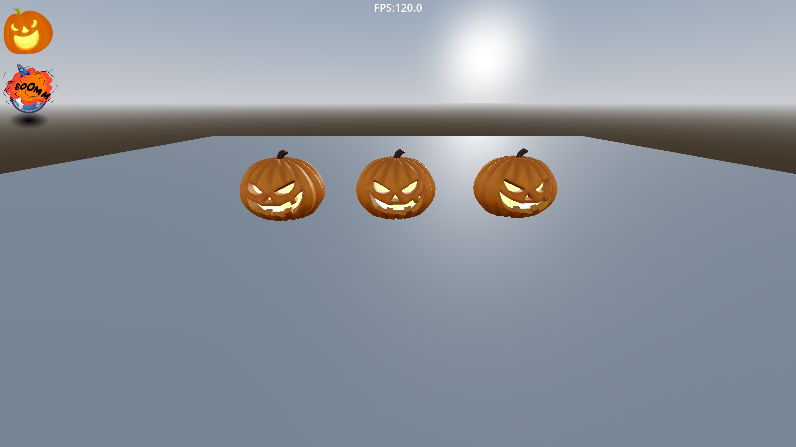
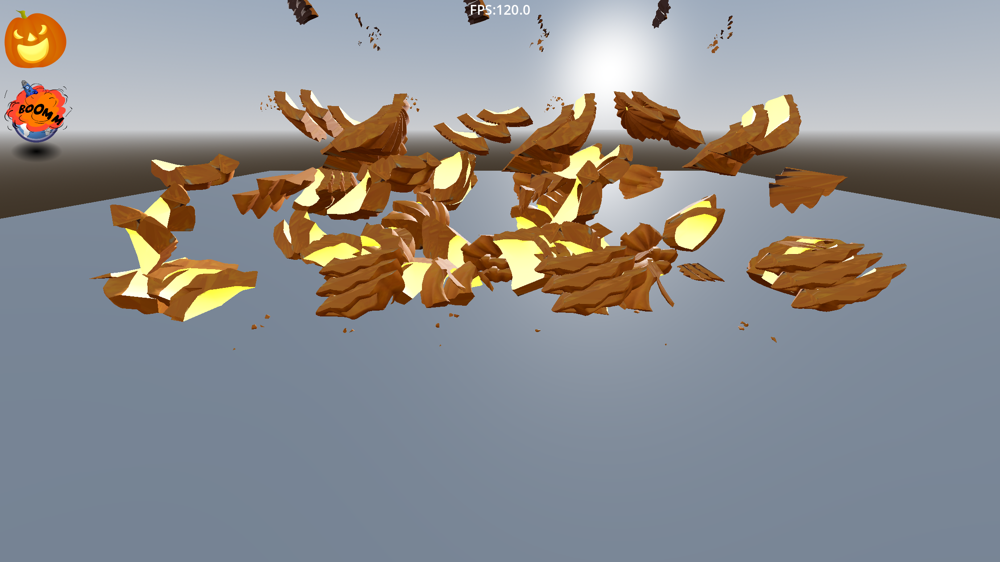
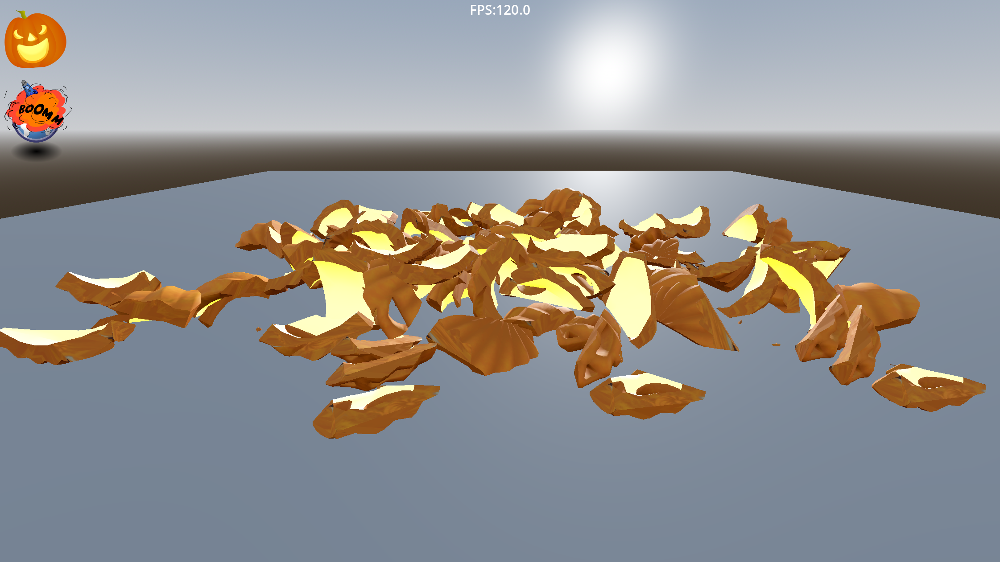

# Pumpkin Destructor

This is a demo of the  Jolt Physics engine running inside the  Godot game engine.\
I created a Godot demo based upon the Youtube video in this link 
[[YouTube video](https://youtu.be/nnb3ATgLftE?si=zGjouys7NYp7Luxs)]\
I wanted to test the performance of the Jolt Physics engine running on an mid-range Android device  
Some notes :
1. I am using the compatibility mode renderer, because it is much more stable on mobile devices
2. Although Jolt performs much better than the default Godot physics, my personal impression is that it needs some more optimizations to work properly on Android devices.
3. Some random stutters during the physics simulation on the Android device.
4. I used Godot version 4.5 beta 3
5. I used the Galaxy Tab A8 as the main testing device

There are 2 touch buttons on the upper left side of the screen:
1. The first button causes the explosion
2. The second button reassembles the scene

## Screenshots

*Intact pumpkin ready for destruction*

*Jolt Physics engine handling multiple fragments*

*Pumpkin fragments after physics simulation*

## License

This project is licensed under the MIT License - see the [LICENSE](LICENSE) file for details.

## Asset Attributions

Some assets in this project are licensed under different terms. See [ATTRIBUTION.md](ATTRIBUTION.md) for complete attribution details.